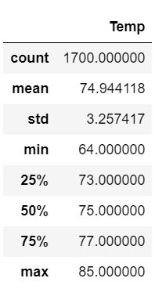

# surfs_up

## Overview/Purpose
The investor-backer for our Surf & Shake shop wants to see a detailed analysis of weather patterns from 2010 through the end of 2017 for a larger sample size. We specifically want to focus on trends for the months of June & December. 

## Results

### June
Out of 1,700 total June temperature recordings, the average was 74.94 degrees, with a minimum of 64.00 degrees and a maximum of 85.00 degrees. 

### December

## Summary & Recommendations
