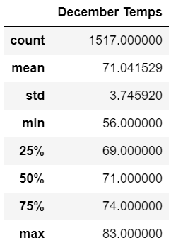

# surfs_up

## Overview/Purpose
The investor-backer for our Surf & Shake shop wants to see a detailed analysis of weather patterns from 2010 through the end of 2017 for a larger sample size. We specifically want to focus on trends for the months of June & December. 

## Results

### June
Out of 1,700 total June temperature recordings, the average was 74.94 degrees, with a minimum of 64.00 degrees and a maximum of 85.00 degrees. 

### December
Out of 1,517 total December temperature recordings, the average was 71.04 degrees, with a minimum of 56.00 degrees and a maximum of 83.00 degrees. 

## Summary & Recommendations
  Pooling data from 2010-2016 to determine a more accurate read on averages, mins & maxs for the temperatures in June & December is valueable to help predict the success of our Surf & Shake shop. The low temperature in December is relatively dramatic at 56, compared to the min and average June. However it would be valueable to pull information on the frequency of these lower temperatures vs. the overall average for December. Since the average in December was only 3 degrees less than the June average, it's a reasonable conclusion that the low temperatures do not occur too frequently. The June temperatures are ideal for surfing and shakes (as expected in Summer), and pulling that data for comparison is helpful in determining if business would be sustainable in the 'colder' months like December. 
  I believe that the temperatures in December will not deter travellers from surfing & indulging in a cold treat on their vacations/weekends. Oahu is a destination that would potentially see an INCREASE in visitors during the winter months, because in comparison the temperatures are significantly warmer than wherever travellers are escaping from. 
  In order to more accurately assess the data I would suggest 'cleaning'. We could remove potential outliers if the frequency of those temperatures happening was very low, they should be considered more of a weather anomoly than a pattern. Another suggestion would be to consider other factors like wind and rain, rather than just overall temperature. It makes sense that if it's extremely windy, the waves might not be ideal for surfing. As someone with the irrational fear of being eaten by a shark, it would also be helpful to analyze migration patterns and frequency of shark-sitings in the vacation destinations to determine where it would be safest to surf! 
